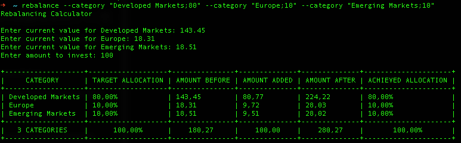

# Rebalancing calculator

Where to put your investments to reach your desired asset allocation?

## Intended use

This calculator is intended to help you allocate investments according to your desired asset allocation. It assumes you do the rebalancing from time to time, e.g. once per year.
After a year of investment the allocation in your portfolio will differ from your desired allocation. That is because the assets will have performed differently. Also you might have changed your opinion about the desired allocation.

This calculator will never advise to **remove** money from a category - because selling assets often results in transaction costs and taxes. Instead it will advise you how to **add** money in the future to achieve or approach your desired allocation.

## Use

```
composer install
php index.php app:rebalance
```

## Remarks

* For the "amount to invest" enter the amount of money you will presumably invest until the next rebalancing (for example for one year). The resulting "Investment Percentage" will tell you how to split your monthly or one time investments between your categories.
* You can enter all amounts with , or . as decimal separator. Don't input any thousands separators.
* You have to make sure your target allocation adds up to 100% - the calculator will not check this.
* It should be obvious, but given that any software can and probably will contain bugs: Use this calculator at your own risk. I am not responsible for any losses you might incur by using this calculator.

